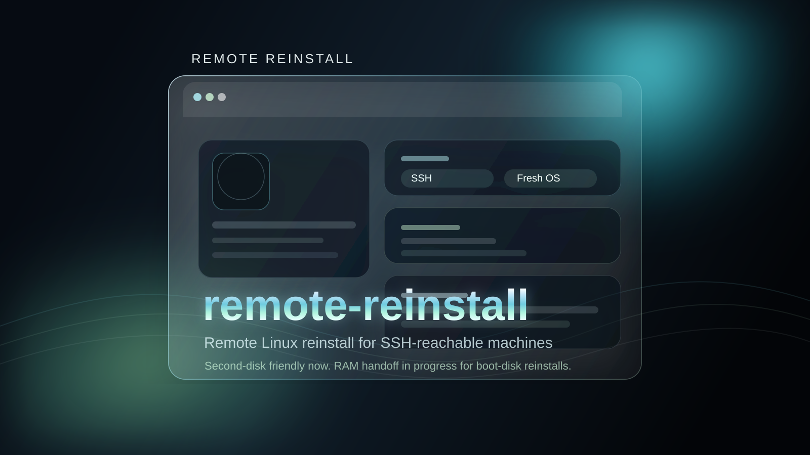
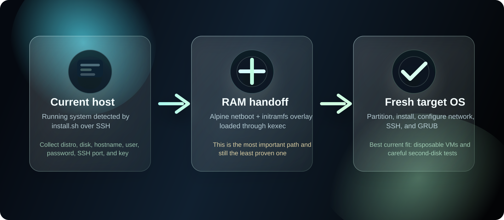

# remote-reinstall

> Remote Linux reinstall for SSH-reachable machines, with a second-disk path today and an experimental RAM handoff for boot-disk reinstalls.

<p align="center">
  
</p>

## What This Repo Is

`remote-reinstall` is an experimental shell-based project aimed at reinstalling Linux on a remote machine without needing to stand in front of it with a USB stick.

The current repository is built around:

- a first-stage launcher in `install.sh`
- distro-specific installer scripts in `distros/`
- shared helpers in `lib/`
- an Alpine-in-RAM second stage in `ram-installer.sh` for cases where the target disk is also the current boot disk

The project goal is simple:

1. keep the machine reachable long enough to hand off installation safely
2. lay down a fresh target distro on disk
3. bring the machine back with networking, SSH, hostname, and user setup already in place

## Status

This repo is a prototype, not a finished one-command remote reinstall system.

What the repository clearly supports today:

- interactive and non-interactive entry through `install.sh`
- distro selection for Ubuntu, Debian, Proxmox, Fedora, Rocky, Arch, and Alpine
- a clearer path when installing to a second disk instead of the currently booted disk
- an embedded second-stage approach for boot-disk reinstalls using Alpine + `kexec`

What is still experimental or incomplete:

- the end-to-end RAM handoff for single-disk hosts still needs real validation
- the RAM path only supports Ubuntu, Debian, Proxmox, and Alpine right now
- the repo does not yet prove production-safe behavior across different hardware providers
- issue [#1](https://github.com/zarigata/remote-reinstall/issues/1) documents that the RAM install path has been a known weak spot

If you are evaluating this project seriously, treat it as:

- good material for architecture review
- promising for VM testing
- not yet something to trust blindly on an irreplaceable remote server

## Why It Exists

Remote reinstalls are annoying because the machine you need to replace is usually the same machine you are currently booted from. That creates a hard problem:

- you need networking to stay alive long enough to finish the handoff
- you often need to wipe the same disk that is keeping the current system running
- if anything goes wrong, SSH is gone and you are suddenly depending on rescue access

This repository is trying to narrow that gap with an SSD-first, remote-first workflow instead of assuming physical access, rescue media, or a local keyboard and monitor.

## Current Flow

<p align="center">
  
</p>

### First Stage: `install.sh`

The first-stage script:

- checks dependencies
- detects the running OS, architecture, boot mode, default route, and primary IP
- collects the target distro, version, disk, hostname, username, password, SSH port, and optional SSH key
- downloads helper files if they are missing locally
- either calls a distro installer directly or switches to the RAM-based handoff when the selected disk is also the boot disk

### Second Stage: `ram-installer.sh`

When the target disk is the same disk the system is currently booted from, the repo tries to:

1. download an Alpine netboot kernel and initramfs into RAM
2. inject `ram-installer.sh` and its config into the initramfs overlay
3. `kexec` into that temporary Alpine environment
4. repartition the target disk from RAM
5. install the selected distro and restore basic SSH/network access

That is the most important idea in the repo, and also the part that still needs the most validation.

## Supported Targets

### In `install.sh`

- Ubuntu: `24.04`, `22.04`, `20.04`
- Debian: `12`, `11`
- Proxmox VE: `8`, `7`
- Fedora: `40`, `39`
- Rocky Linux: `9`, `8`
- Arch Linux: `latest`
- Alpine Linux: `3.19`, `3.18`, `edge`

### In `ram-installer.sh`

The RAM-based second stage currently implements installers for:

- Ubuntu
- Debian
- Proxmox VE
- Alpine Linux

That means the repo currently advertises more targets than the boot-disk RAM flow actually implements.

## Safer Use Cases Right Now

The safest way to work with the repo today is:

1. test in a disposable VM first
2. prefer a second attached disk
3. keep provider console or rescue access available
4. assume manual recovery may still be necessary

If your host only has one boot disk, the RAM handoff is the critical path and should still be considered experimental.

## Repository Layout

```text
remote-reinstall/
├── assets/
│   └── readme/
│       ├── dark-aero-flow.svg    # workflow graphic for the README
│       └── dark-aero-hero.svg    # hero banner for the README
├── install.sh                # first-stage launcher and flow controller
├── ram-installer.sh          # Alpine-in-RAM second-stage installer
├── lib/
│   ├── common.sh             # chroot, SSH, user, GRUB helpers
│   ├── network.sh            # network config helpers
│   └── partition.sh          # partition and mount helpers
├── distros/
│   ├── alpine.sh
│   ├── arch.sh
│   ├── debian.sh
│   ├── fedora.sh
│   ├── proxmox.sh
│   ├── rocky.sh
│   └── ubuntu.sh
└── README.md
```

## Quick Start

### Interactive

```bash
curl -fsSL https://raw.githubusercontent.com/zarigata/remote-reinstall/main/install.sh | sudo bash
```

### Non-Interactive

```bash
curl -fsSL https://raw.githubusercontent.com/zarigata/remote-reinstall/main/install.sh | sudo bash -s -- \
  --distro ubuntu \
  --version 24.04 \
  --disk /dev/sdb \
  --hostname myserver \
  --username admin \
  --password 'replace-me' \
  --ssh-port 22
```

## What The Scripts Configure

Depending on the chosen path and distro, the repo aims to set:

- partition table and filesystems
- hostname
- a primary user
- password and optional SSH public key
- SSH daemon port and basic SSH settings
- static networking based on the current machine's active interface
- GRUB bootloader installation

## Risks and Gaps

These are the main repo-level risks visible right now:

- the README can only be as confident as the scripts deserve, and the scripts are still evolving
- distro coverage differs between the first-stage selector and the second-stage RAM installer
- network preservation is highly environment-dependent across VPS vendors and dedicated hardware
- bootloader behavior, interface naming, and static IP carry-over need real-world validation
- "works in theory" is not the same thing as "survives a reboot on live infrastructure"

## Practical Roadmap

The most useful next steps for the project appear to be:

1. fully validate the RAM-based handoff on repeatable VMs
2. narrow the "known-good" matrix before expanding distro claims
3. document provider-specific caveats for Hetzner, OVH, DigitalOcean, and similar environments
4. add a clearer test matrix showing what is merely implemented versus what is actually verified

## Contributing

Contributions are especially helpful around:

- tightening the RAM handoff
- improving disk and bootloader safety
- documenting validation steps and recovery expectations
- reducing the gap between claimed support and verified support

## License

MIT. See `LICENSE`.
